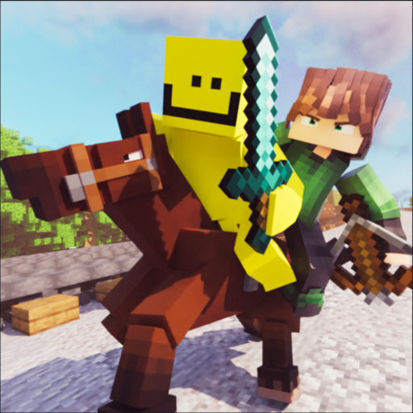

<p align="center">
  
</p>

# Kaffee's Dual Ride

This is a tiny mod that allows two players to sit on a horse. It is required on Client and Server. It is licensed under GPLv3. Sourcecode available on [Github](https://github.com/0ql/kaffees_dual_ride).

[Curseforge](https://www.curseforge.com/minecraft/mc-mods/kaffees-dual-ride)
[Modrinth](https://modrinth.com/mod/kaffees_dual_ride)

## Dev

To start two Minecraft clients at once for testing:
```bash
./gradlew launch2clients
```

## Credits

Icon art by [fyoncle](https://www.artstation.com/fyoncle).
